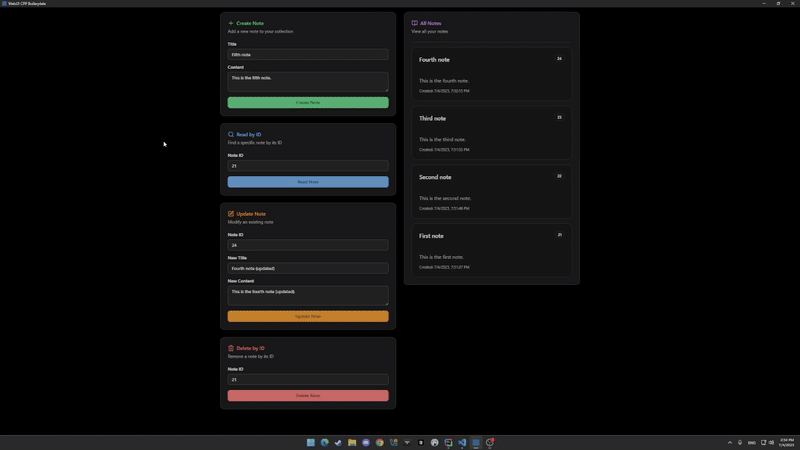

## webui-cpp-boilerplate

This is a boilerplate I put together for making desktop apps that are easy to hack on and share. Whenever I want to spin up a new desktop app, I can clone this, make a few tweaks, and I'm set.

- I wanted something for Windows that provides a single, small binary to share with friends or coworkers.
- Backend is C++ (webui) and frontend is Typescript (react).
- No huge dependencies, no weird setup, just clone and go.

## Demo:

## Libraries

### Backend (C++)

- **[webui](https://github.com/webui-dev/webui)** - Cross-platform webview library for creating desktop applications
- **[nlohmann/json](https://github.com/nlohmann/json)** - Modern C++ JSON library
- **[spdlog](https://github.com/gabime/spdlog)** - Fast C++ logging library
- **[argparse](https://github.com/p-ranav/argparse)** - Argument parser for C++17
- **[sqlite3](https://www.sqlite.org/)** - Self-contained, serverless SQL database engine
- **[sqlite3pp](https://github.com/iwongu/sqlite3pp)** - C++ wrapper for SQLite3

### Frontend (TypeScript/React)

- **[React](https://react.dev/)** - JavaScript library for building user interfaces
- **[Vite](https://vitejs.dev/)** - Fast build tool and dev server
- **[Tailwind CSS](https://tailwindcss.com/)** - Utility-first CSS framework
- **[shadcn/ui](https://ui.shadcn.com/)** - Re-usable components built with Radix UI and Tailwind CSS
- **[TanStack Query](https://tanstack.com/query)** - Powerful data synchronization for React
